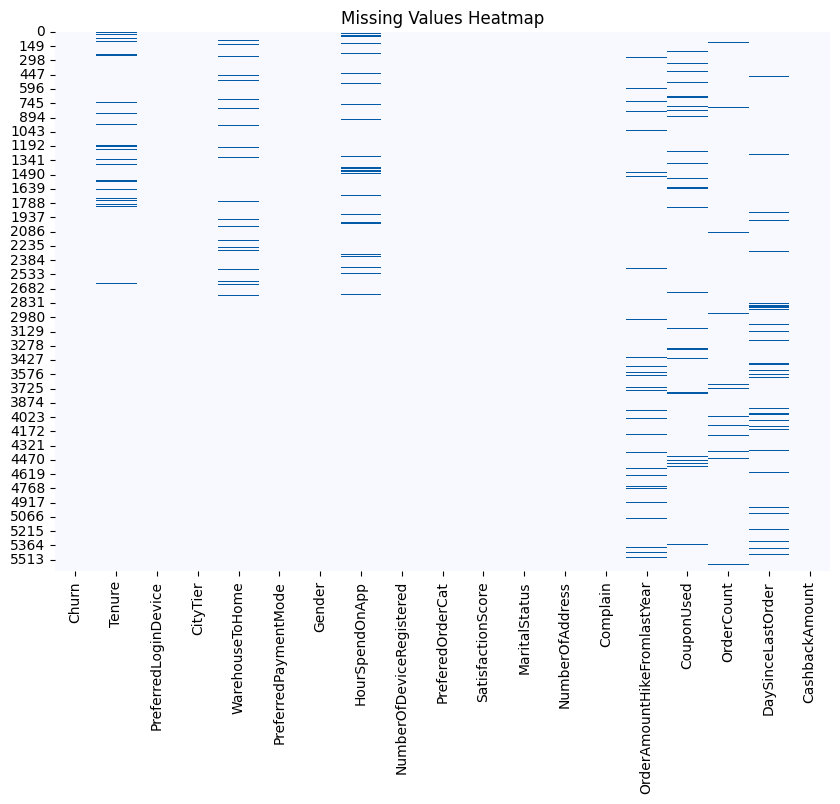
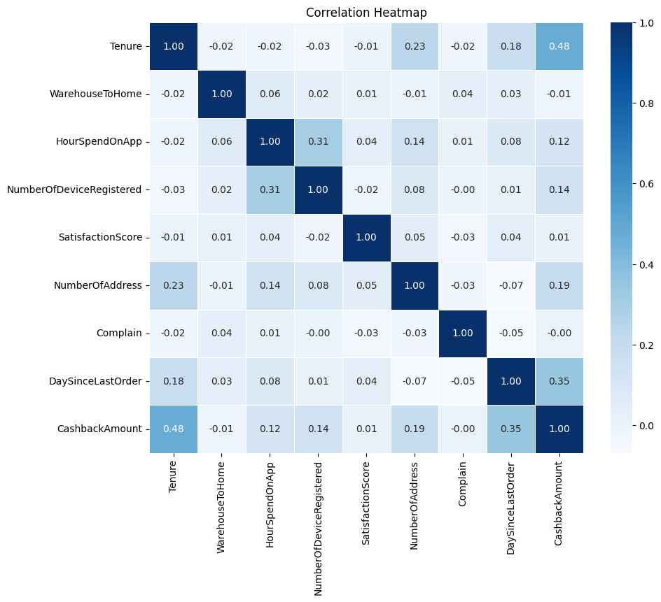

# Curbing Customer Churn with Machine Learning
#### Created By: Cinira Harsaning Aziz, Inggartista Abi Gumintang, Hans Christian Don
Tableau: [Link](https://public.tableau.com/app/profile/cinira.harsaning/viz/E-CommerceCustomerChurn_17268234742840/E-CommerceCustomerChurn?publish=yes)

## Context
An online retail company aims to increase profitability by focusing on customer retention over acquisition, as retaining customers costs significantly less. Research shows that increasing retention by 5% can boost revenue by 25% to 95% (Amy Gallo, HBR). By identifying potential churn early, businesses can target interventions to improve retention and drive profit.

## Problem Statement
To reduce churn and optimize marketing costs, machine learning models can predict at-risk customers. This enables targeted marketing efforts, reducing spending on low-risk customers and focusing on high-value individuals. E-commerce companies that adopt churn prediction improve customer retention, lower marketing costs, and enhance profitability.

## Goals
- Predict Churn: Identify customers likely to churn and target them with focused marketing.
- Optimize Marketing Spend: Prioritize promotional efforts for high-risk customers to reduce unnecessary costs.
- Identify Churn Factors: Uncover key churn drivers to guide cost-effective marketing strategies.

## Analytic Approach
We will build a classification model using customer data to predict churn. The insights will guide retention strategies, helping the company minimize churn and allocate resources efficiently.

## Metric Evaluation
The performance is evaluated using the F2 score, prioritizing recall to reduce False Negatives (Type 2 errors). This approach ensures focus on capturing at-risk customers while controlling marketing costs.
- True Positive (TP): Predicted churn, actual churn.
- False Positive (FP): Predicted churn, no churn.
- False Negative (FN): Predicted no churn, actual churn.
- True Negative (TN): Predicted no churn, no churn.

F2 Score formula: `F2 = (5 * Precision * Recall) / (4 * Precision + Recall)`

## Data Overview
The dataset comes from a leading e-commerce company aiming to predict customer churn and improve retention through targeted promotions. It includes various customer-related attributes such as `Tenure`, `PreferredLoginDevice`, `CityTier`, `SatisfactionScore`, and `OrderCount`.

### Key Insights:
- Customer Segmentation: Use features like `CityTier`, `PreferredOrderCat`, and `PreferredPaymentMode` to group customers and tailor marketing strategies.
- Churn Prediction: Key predictors such as `Tenure`, `SatisfactionScore`, and `DaySinceLastOrder` can help identify customers likely to churn.
- Behavioral Analysis: Understanding features like `HourSpendOnApp`, `Complain`, and `OrderAmountHikeFromlastYear` provides insights into customer engagement and satisfaction.
- Targeted Marketing: Leverage data on `CouponUsed` and `CashbackAmount` to optimize promotional offers for customers at risk of churn.

### Data Features:
[Dataset: E-commerce Customer Churn Analysis and Prediction](https://www.kaggle.com/datasets/ankitverma2010/ecommerce-customer-churn-analysis-and-prediction?resource=download)

| Attribute                | Description                                          |
| ------------------------ | ---------------------------------------------------- |
| `CustomerID`             | Unique identifier for each customer                  |
| `Churn`                  | Indicator of churn (1 = churned, 0 = not churned)     |
| `Tenure`                 | Number of months with the company                    |
| `PreferredLoginDevice`   | Device most used by the customer to login            |
| `CityTier`               | Tier level of the customer's city                    |
| `WarehouseToHome`        | Distance from warehouse to home (in km)              |
| `PreferredPaymentMode`   | Customer's preferred payment method                  |
| `Gender`                 | Customer's gender                                    |
| `HourSpendOnApp`         | Total hours spent on the app                         |
| `NumberOfDeviceRegistered`| Number of devices registered to the account         |
| `PreferedOrderCat`       | Preferred order category last month                  |
| `SatisfactionScore`      | Customer satisfaction rating                         |
| `MaritalStatus`          | Marital status                                       |
| `NumberOfAddress`        | Number of addresses linked to the customer           |
| `Complain`               | Indicator of complaints in the last month            |
| `OrderAmountHikeFromlastYear`| Percentage increase in order amount from last year |
| `CouponUsed`             | Coupons used last month                              |
| `OrderCount`             | Number of orders placed in the last month            |
| `DaySinceLastOrder`      | Days since last order                                |
| `CashbackAmount`         | Average cashback received last month                 |

### Core Libraries Used:
- Pandas, NumPy: For data manipulation and analysis.
- Matplotlib, Seaborn: For data visualization.
- Scikit-learn, Imbalanced-learn: For machine learning models and handling imbalanced datasets.
- XGBoost, LightGBM: For advanced classification models.
- SHAP: For model explainability.
- This dataset provides a strong foundation for building predictive models to improve customer retention and optimize marketing efforts.

## Data Cleaning

### Drop CustomerID
We removed the `CustomerID` column since it is a unique identifier and doesn't contribute to analysis or model training.

### Handling Inconsistent Data
Standardized values in `PreferredLoginDevice`, `PreferredPaymentMode`, and `PreferedOrderCat` to ensure consistent categories.
- Post-standardization:
    - PreferredLoginDevice: 'Mobile Phone' (3996 entries), 'Computer' (1634 entries)
    - PreferredPaymentMode: 'Debit Card' (2099), 'Credit Card' (1596), etc.
    - PreferedOrderCat: 'Mobile Phone' (1856), 'Laptop & Accessory' (1847), etc.

### Handling Duplicates
Removed 9.88% duplicate rows, reducing the dataset size from 5630 to 5074.

### Handling Outliers
- CashbackAmount: 7.53% outliers, likely related to loyalty programs.
- Other features have minimal outliers (0.04% to 1.12%).

### Handling Missing Values

Columns like `Tenure`, `WarehouseToHome`, and `DaySinceLastOrder` have missing values (4.46% - 5.45%). KNNImputer will be applied during the pipeline process for imputation.

## Exploratory Data Analysis

### Churn vs Non-Churn
A churn rate of 16.6% indicates a need for expanded customer segmentation and retention strategies, such as personalized campaigns.

### Data Distribution
Features exhibit non-normal distributions; non-parametric techniques and robust scaling are necessary.

### Correlation

Correlation among variables is generally weak, suggesting potential non-linear relationships.

### Churn by Preferences
- Login Device: Mobile Phone (15.4% churn) vs. Computer (19.6% churn). Focus on mobile optimization.
- Payment Method: UPI (15.6% churn); enhance partnerships and offer promotions.
- Order Category: Laptop & Accessories (15.6% churn); diversify product offerings.
- Satisfaction Score: Customers with high scores also churn; improve engagement.

### Churn by Behavior

- Tenure & Order Count: High churn in the first month; focus on early engagement.
- Complaints: 31.31% of churn comes from customers who filed complaints; improve complaint resolution.

### Other Variables
WarehouseToHome: Churn increases with distance from the warehouse; optimize the delivery experience for distant customers.

### Modeling

#### Data Preprocessing & Feature Engineering
For numerical features, a pipeline was set up with KNNImputer for missing values and RobustScaler for handling outliers. Categorical features were processed using One-Hot Encoding, Binary Encoding, and Ordinal Encoding depending on the feature type, ensuring consistent handling of missing values and encoding before model training.

#### Model Benchmarking
Top-performing models included LightGBM and XGBoost, which achieved high F2 scores, particularly with Random Over Sampler (ROS). Stacking models also showed excellent performance. Bagging, Random Forest, and Decision Trees provided moderate results, while KNN-based models performed the weakest, especially with under-sampling techniques like Near Miss.

#### Resampling Methods
Resampling significantly improved model performance. XGBoost with ROS achieved an F2 score of 92.37%, while LightGBM with ROS scored 91.78%. LGBM with SVMSMOTE showed strong balance, with an F2 score of 91.51%. Lower-performing models, like KNN with Tomek Links, had significantly reduced scores (F2 as low as 53.85%).

#### Hyperparameter Tuning
XGBoost with ROS achieved a recall of 92.86%, prioritizing recall and minimizing false negatives, essential for churn prediction. Similarly, LightGBM with ROS maintained high recall (91.67%) and precision (89.02%), ensuring a balanced model. LightGBM with SVMSMOTE offered slightly improved recall (92.26%), maintaining strong accuracy and precision, and achieving an F2 score of 92.70%.

These models consistently demonstrated their effectiveness at handling imbalanced data, particularly in correctly identifying churners while minimizing false positives.

### Model Performance Summary

#### Best Models
- XGBoost + ROS (Tuned): 93% Recall, 87% Precision, F2 0.915 (best for reducing false negatives).
- LGBM + ROS (Tuned): 92% Recall, 89% Precision, F2 0.911.
- LGBM + SVMSMOTE (Tuned): 91% Recall, 93% Precision, F2 0.915.
- All models achieved 96%-97% accuracy and high F1-scores for both churners and non-churners.

#### Selected Model
XGBoost + ROS is the best model with an F2 score of 0.915, excelling in predicting churn with high recall and minimal errors.

#### Profit Projection
- Without ML: A $8,750/month loss due to excessive promotions.
- With ML: A $27,000/month profit by targeting promotions more effectively.

#### Key Churn Drivers
`Tenure`, and `Complain` are the main factors influencing churn prediction.

#### Model Limitations
- Risk of overfitting with ROS.
- High computational cost.
- Potential bias towards minority class (churners).

#### Recommendations
- Increase cashback, improve product quality, and enhance customer service.
- Encourage user engagement within the first 1-4 hours.
- Promote repeat purchases to reduce churn.
